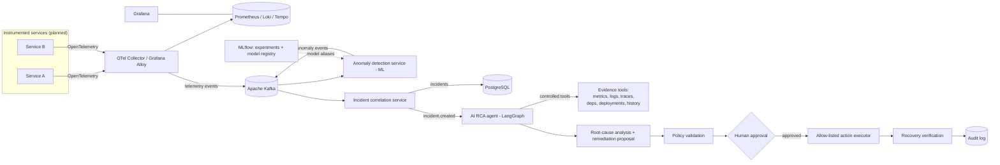

# SentinelOps AI

> **Current status: Phase 3 — Incident correlation + persistence.**
> Only the items under [Current status](#current-status) are implemented.
> Everything under [Planned architecture](#planned-architecture) and
> [Technology roadmap](#technology-roadmap) is future work and is labelled as such.

## What it is

SentinelOps AI is a planned ML-powered, cloud-native **incident intelligence
platform**. It observes distributed application telemetry, detects abnormal
behaviour with machine-learning models, correlates the abnormal signals into
incidents, and then uses a tool-using AI agent to investigate each incident,
produce evidence-backed root-cause analysis, and recommend a safe remediation
that a human must approve before anything is executed.

## Problem

When a distributed system misbehaves, on-call engineers are handed a wall of
dashboards, logs, traces, and alerts and must manually reconstruct *what broke*,
*why*, and *what to do about it* — under time pressure. This is slow, error
prone, and hard to audit. Static threshold alerts are noisy, and the knowledge
of how to investigate lives in a few people's heads.

SentinelOps AI aims to compress the "signal → incident → root cause →
safe remediation" loop while keeping a human firmly in control of any action
that changes the running system.

## Core idea

```
Telemetry
  → anomaly detection (ML)
  → incident creation (correlation)
  → AI investigation (tool-using agent)
  → root-cause analysis (evidence-backed)
  → human-approved remediation (allow-listed actions)
  → recovery verification
  → audit trail (throughout)
```

Two responsibilities are kept **separate on purpose**:

- **Machine learning** detects anomalies in telemetry whose feature space
  matches the live system.
- **The AI agent** investigates incidents, reasons over collected evidence,
  performs root-cause analysis, and proposes remediation.

An LLM API call is *not* the ML component. See
[ADR-002](docs/decisions/adr-002-ml-and-llm-separation.md).

## Planned architecture

> Target design. As of Phase 3, the Kafka backbone, `orders-service`, live
> anomaly detection, and incident correlation + persistence (PostgreSQL) exist;
> the AI RCA agent and everything downstream is future work. See
> [Current status](#current-status).



## Technology roadmap

Introduced **only in the phase that needs it**, never earlier:

| Area | Direction |
| --- | --- |
| Backend | Python, FastAPI |
| ML | scikit-learn, XGBoost, pandas, NumPy, MLflow (model aliases, not stages); PyTorch only if justified |
| AI agent | LangGraph (or an equivalent explicit state-machine agent), an LLM API, tool calling |
| Data | PostgreSQL; Redis where justified |
| Messaging | Apache Kafka (event backbone) |
| Observability | OpenTelemetry, Prometheus, Loki, Tempo, Grafana (Alloy/OTel collection, not Promtail) |
| Datasets | HDFS, BGL, NAB for offline experimentation/evaluation — evaluated **separately** from live synthetic telemetry ([ADR-004](docs/decisions/adr-004-datasets-vs-live-telemetry.md)) |
| Containers | Docker, Docker Compose |
| Orchestration | Kubernetes |
| Cloud | AWS |
| IaC | Terraform |
| CI/CD | GitHub Actions |
| Frontend | React / Next.js (or another justified modern choice) |
| Testing | pytest, integration tests, later load testing |

## Project phases

| Phase | Focus | State |
| --- | --- | --- |
| **0** | Repository & development foundation | **done** |
| **1** | Event backbone (Kafka) + a first instrumented service emitting telemetry | **done** |
| **2** | ML anomaly-detection pipeline + offline evaluation (real metrics) | **done** |
| **3** | Incident correlation + persistence (deterministic rules, PostgreSQL, Incident API) | **done** |
| 4 | AI RCA agent with controlled evidence tools | planned |
| 5 | Human-approved, allow-listed remediation + recovery verification + audit | planned |
| 6 | MLOps lifecycle: MLflow, model monitoring, drift detection, retraining | planned |
| 7 | Observability stack (OpenTelemetry, Prometheus, Loki, Tempo, Grafana) | planned |
| 8 | Kubernetes, cloud (AWS), Terraform, hardened CI/CD | planned |

The roadmap is a direction, not a contract; later phases may re-scope earlier
ones. See [docs/phases/roadmap.md](docs/phases/roadmap.md).

## Development

> Every command below works today. Prerequisites: Python 3.12+ (dev machine
> uses 3.14), Git, Docker Desktop (Kafka + PostgreSQL).

```bash
# 1. Virtual environment + dependencies
python -m venv .venv
source .venv/Scripts/activate      # Windows Git Bash;  .venv/bin/activate on Unix
pip install -e ".[dev,ml,incident,detector]"
cp .env.example .env

# 2. The full pipeline (Phases 1 + 3): Kafka, PostgreSQL, orders-service,
#    anomaly-detector, incident-correlator (+ one-shot DB migration)
docker compose up --build -d
python scripts/generate_traffic.py --scenario sequence --duration 40 --rate 6
curl -s http://localhost:8002/incidents | python -m json.tool   # the correlated incident

# 3. Deterministic incident-correlation demo — no Kafka, no DB
make incident-scenario

# 4. Phase 2 ML: reproduce every experiment on the committed datasets
make ml-experiments                # -> artifacts/reports/ + summary.md
```

With `make` (Git Bash): `make install`, `make compose-up`, `make db-migrate`,
`make run-correlator`, `make ml-experiments`, `make check`. Full instructions
incl. PowerShell in [docs/development/setup.md](docs/development/setup.md).

## Testing

```bash
pytest                                                    # all unit tests — or: make test
make ml-test                                               # just the ML suite
docker compose up -d kafka postgres && make db-migrate && \
  make test-integration                                   # Kafka + PostgreSQL integration tests
```

Tests live in [tests/](tests/): the platform API smoke tests,
[tests/orders_service/](tests/orders_service/) (order validation, event schema,
publisher, failure injection, instrumentation, one Kafka round-trip), and
[tests/ml/](tests/ml/) (parsing, validation, feature causality & no-leakage,
splits, detectors, save/load, inference, metrics, an experiment repro check).

## Environment variables

`.env.example` is the documented template of every supported variable. Copy it
to `.env` (git-ignored) for local development. All variables are read through
the typed `sentinelops_api.config.Settings` object (prefix `APP_`) — code does
not read `os.environ` directly. Future subsystems add their settings there.

## Security principles

- **No secrets in Git.** `.env` is ignored; only `.env.example` (placeholders)
  is committed.
- **Least privilege.** The container runs as a non-root user; future cloud/agent
  access is scoped, not blanket.
- **Controlled tools.** The AI agent will only ever act through an explicit,
  allow-listed set of evidence/action tools.
- **Human approval for remediation.** No automated change to a running system
  without a human in the loop ([ADR-003](docs/decisions/adr-003-human-in-the-loop-remediation.md)).
- **Auditability.** Investigation, approval, action, and verification are all
  recorded.

## Current status

### Phase 0 — Repository & Development Foundation *(done)*

Repo structure and docs (README, architecture overview, ADRs, setup, roadmap);
`pyproject.toml`; the platform API skeleton (`apps/api/sentinelops_api`) with
`GET /health` and `GET /`; Ruff + mypy (strict) + pytest; `Makefile`,
`Dockerfile`, `docker-compose.yml`, `.env.example`, GitHub Actions CI.

### Phase 1 — Event backbone + first instrumented service *(done)*

- **Kafka event backbone** — single-node KRaft broker in Docker Compose; topic
  `orders.events`; a versioned `order.created` event envelope
  ([docs/architecture/events.md](docs/architecture/events.md),
  [ADR-006](docs/decisions/adr-006-kafka-local-deployment-and-client.md)).
- **`orders-service`** (`apps/orders-service`) — a demo app under observation:
  `POST /orders` creates an order and synchronously publishes its event
  ([ADR-010](docs/decisions/adr-010-phase1-synchronous-publish.md)); also
  `GET /orders/{id}`, `/health`, `/ready`, `/metrics`.
- **OpenTelemetry instrumentation** — HTTP + business spans; Prometheus-scraped
  metrics (with a deliberate low-cardinality label policy); structured JSON logs
  carrying `trace_id`/`span_id`
  ([ADR-007](docs/decisions/adr-007-opentelemetry-instrumentation-standard.md),
  [ADR-008](docs/decisions/adr-008-events-vs-telemetry.md)).
- **Trace correlation into events** — `traceparent` injected into Kafka headers;
  a demo consumer continues the trace.
- **Controlled failure injection** (dev-only, disabled by default,
  [ADR-009](docs/decisions/adr-009-controlled-failure-injection.md)) + a
  **traffic generator** for reproducible telemetry scenarios
  ([docs/development/telemetry-scenarios.md](docs/development/telemetry-scenarios.md)).

Details: [docs/architecture/phase-1.md](docs/architecture/phase-1.md).

### Phase 2 — ML anomaly detection + offline evaluation *(done, offline)*

The `ml/` subsystem — an offline pipeline, not yet wired into the live path.

- **Track A dataset** — built by scraping `orders-service` `/metrics` every 10 s
  under a seeded sequence of fault scenarios; counter deltas → per-window rate
  signals; ground-truth labels kept separate; boundary/reset windows dropped
  ([ADR-011](docs/decisions/adr-011-ml-dataset-via-metrics-scraping.md)). Two
  canonical runs committed as small CSVs.
- **Feature engineering** — 23 causal features (rates, latency percentiles,
  rolling mean/std, deltas, growth rate); *one* implementation shared by
  training and streaming inference, with a test that they agree row-for-row and
  a test that no injected-fault ground truth leaks in.
- **Leak-safe splits** — chronological train/val/test, plus a held-out-fault
  split (train on latency+error faults, test on publish-failure+surge).
- **Detectors** — robust median/MAD z-score **baseline**; **Isolation Forest**
  primary ([ADR-012](docs/decisions/adr-012-isolation-forest-primary-detector.md));
  supervised Random Forest comparator. Shared `fit / score / predict / save /
  load` interface.
- **Evaluation** — window-wise precision/recall/F1/FPR/FNR/PR-AUC/confusion plus
  event-wise detection delay and false-alarms-per-hour.
- **Experiments 1-6** — baseline, IF, three-way comparison, held-out fault, and
  the same methodology on the independent **NAB** benchmark (downloaded, not
  committed — [ADR-013](docs/decisions/adr-013-nab-benchmark-track.md)). Results
  in `artifacts/reports/`.
- **Phase 3 boundary** — `ml.inference.DetectorService.score_window(signals) →
  AnomalyResult`.

Details + all measured numbers: [docs/architecture/phase-2.md](docs/architecture/phase-2.md).

### Phase 3 — Incident correlation + persistence *(done)*

- **`libs/sentinelops_common/`** — shared plumbing extracted from `orders_service`:
  the Kafka event envelope + versioned payload contracts, JSON logging + OpenTelemetry
  setup, a JSON producer, and an idempotent consumer.
- **`anomaly-detector`** (`services/anomaly-detector`) — the Phase 2 → 3 handoff.
  Scrapes `orders-service` `/metrics` every 10 s, rebuilds each telemetry window
  with the Phase 2 code, scores it with the Isolation Forest model (trained once
  at startup from committed data, fixed seed), and publishes `anomaly.detected`.
- **`incident-correlator`** (`services/incident-correlator`) — consumes
  `anomaly.detected` and groups related anomalies for a service into one
  **incident** with **deterministic, explainable** rules: a correlation key
  (`service:environment`) plus a configurable time window — **no LLM**
  ([ADR-015](docs/decisions/adr-015-deterministic-anomaly-correlation.md)).
  Severity is a deterministic rule engine (INFO…CRITICAL), every firing rule
  recorded.
- **PostgreSQL** (SQLAlchemy 2.0 async + Alembic —
  [ADR-014](docs/decisions/adr-014-postgresql-for-incident-state.md)) — incidents,
  evidence, and an append-only state-transition history. A partial unique index
  enforces one active incident per key; `event_id` uniqueness makes replays
  idempotent. Offset committed only after the DB transaction
  ([ADR-016](docs/decisions/adr-016-idempotent-kafka-consumer.md)); poison
  messages go to `anomaly.events.dlq`.
- **Incident API** (`:8002`, internal) — list/detail/evidence/history with
  filters, plus acknowledge / resolve / transition against an explicit state
  machine ([ADR-017](docs/decisions/adr-017-incident-state-machine.md)).
  `incident.*` lifecycle events are published for Phase 4.

Details: [docs/architecture/phase-3.md](docs/architecture/phase-3.md) ·
[docs/architecture/incident-model.md](docs/architecture/incident-model.md).

**Not implemented** (later phases): the AI RCA agent / LangGraph / LLM calls;
remediation and human-approval workflow; MLflow / model registry; XGBoost / deep
models; a deployed observability stack; Kubernetes; AWS; Terraform;
authentication; cross-service / topology-aware correlation.
