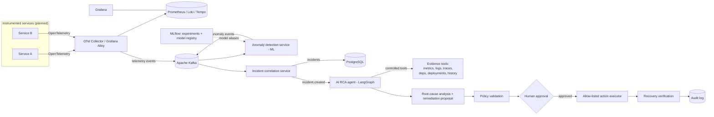

# SentinelOps AI

> **Current status: Phase 0 — Repository & Development Foundation.**
> Only the items under [Current status](#current-status) are implemented.
> Everything under [Planned architecture](#planned-architecture) and
> [Technology roadmap](#technology-roadmap) is future work and is labelled as such.

## What it is

SentinelOps AI is a planned ML-powered, cloud-native **incident intelligence
platform**. It observes distributed application telemetry, detects abnormal
behaviour with machine-learning models, correlates the abnormal signals into
incidents, and then uses a tool-using AI agent to investigate each incident,
produce evidence-backed root-cause analysis, and recommend a safe remediation
that a human must approve before anything is executed.

## Problem

When a distributed system misbehaves, on-call engineers are handed a wall of
dashboards, logs, traces, and alerts and must manually reconstruct *what broke*,
*why*, and *what to do about it* — under time pressure. This is slow, error
prone, and hard to audit. Static threshold alerts are noisy, and the knowledge
of how to investigate lives in a few people's heads.

SentinelOps AI aims to compress the "signal → incident → root cause →
safe remediation" loop while keeping a human firmly in control of any action
that changes the running system.

## Core idea

```
Telemetry
  → anomaly detection (ML)
  → incident creation (correlation)
  → AI investigation (tool-using agent)
  → root-cause analysis (evidence-backed)
  → human-approved remediation (allow-listed actions)
  → recovery verification
  → audit trail (throughout)
```

Two responsibilities are kept **separate on purpose**:

- **Machine learning** detects anomalies in telemetry whose feature space
  matches the live system.
- **The AI agent** investigates incidents, reasons over collected evidence,
  performs root-cause analysis, and proposes remediation.

An LLM API call is *not* the ML component. See
[ADR-002](docs/decisions/adr-002-ml-and-llm-separation.md).

## Planned architecture

> **None of the components below exist yet.** This is the target design.



## Technology roadmap

Introduced **only in the phase that needs it**, never earlier:

| Area | Direction |
| --- | --- |
| Backend | Python, FastAPI |
| ML | scikit-learn, XGBoost, pandas, NumPy, MLflow (model aliases, not stages); PyTorch only if justified |
| AI agent | LangGraph (or an equivalent explicit state-machine agent), an LLM API, tool calling |
| Data | PostgreSQL; Redis where justified |
| Messaging | Apache Kafka (event backbone) |
| Observability | OpenTelemetry, Prometheus, Loki, Tempo, Grafana (Alloy/OTel collection, not Promtail) |
| Datasets | HDFS, BGL, NAB for offline experimentation/evaluation — evaluated **separately** from live synthetic telemetry ([ADR-004](docs/decisions/adr-004-datasets-vs-live-telemetry.md)) |
| Containers | Docker, Docker Compose |
| Orchestration | Kubernetes |
| Cloud | AWS |
| IaC | Terraform |
| CI/CD | GitHub Actions |
| Frontend | React / Next.js (or another justified modern choice) |
| Testing | pytest, integration tests, later load testing |

## Project phases

| Phase | Focus | State |
| --- | --- | --- |
| **0** | Repository & development foundation | **done** |
| 1 | Event backbone + a first instrumented service emitting telemetry | planned |
| 2 | ML anomaly-detection pipeline + offline evaluation (real metrics) | planned |
| 3 | Incident correlation + persistence | planned |
| 4 | AI RCA agent with controlled evidence tools | planned |
| 5 | Human-approved, allow-listed remediation + recovery verification + audit | planned |
| 6 | MLOps lifecycle: MLflow, model monitoring, drift detection, retraining | planned |
| 7 | Observability stack (OpenTelemetry, Prometheus, Loki, Tempo, Grafana) | planned |
| 8 | Kubernetes, cloud (AWS), Terraform, hardened CI/CD | planned |

The roadmap is a direction, not a contract; later phases may re-scope earlier
ones. See [docs/phases/roadmap.md](docs/phases/roadmap.md).

## Development

> Phase 0 commands only — every command below actually works today.

Prerequisites: Python 3.12+ (dev machine uses 3.14), Git. Docker optional.

```bash
# 1. Create and populate a virtual environment
python -m venv .venv
source .venv/Scripts/activate      # Windows Git Bash
# source .venv/bin/activate        # macOS / Linux
pip install -e ".[dev]"

# 2. Configure environment
cp .env.example .env

# 3. Run the API (http://localhost:8000, docs at /docs)
uvicorn sentinelops_api.main:app --reload --app-dir apps/api
```

With `make` (Git Bash on Windows): `make install`, `make run`, `make check`.
Full instructions, including the PowerShell equivalents, are in
[docs/development/setup.md](docs/development/setup.md).

## Testing

```bash
pytest            # or: make test
```

Tests live in [tests/](tests/) and currently prove the app assembles, serves
`/health`, `/`, and the OpenAPI schema.

## Environment variables

`.env.example` is the documented template of every supported variable. Copy it
to `.env` (git-ignored) for local development. All variables are read through
the typed `sentinelops_api.config.Settings` object (prefix `APP_`) — code does
not read `os.environ` directly. Future subsystems add their settings there.

## Security principles

- **No secrets in Git.** `.env` is ignored; only `.env.example` (placeholders)
  is committed.
- **Least privilege.** The container runs as a non-root user; future cloud/agent
  access is scoped, not blanket.
- **Controlled tools.** The AI agent will only ever act through an explicit,
  allow-listed set of evidence/action tools.
- **Human approval for remediation.** No automated change to a running system
  without a human in the loop ([ADR-003](docs/decisions/adr-003-human-in-the-loop-remediation.md)).
- **Auditability.** Investigation, approval, action, and verification are all
  recorded.

## Current status

**Phase 0 — Repository & Development Foundation.** Implemented:

- Repository structure and foundational documentation (this README, architecture
  overview, ADRs, development setup, phase roadmap).
- Python project configuration (`pyproject.toml`): metadata, minimal runtime
  deps (FastAPI, Uvicorn, pydantic-settings), dev deps (pytest, httpx, Ruff,
  mypy).
- Minimal FastAPI app (`apps/api/sentinelops_api`) exposing `GET /health` and
  `GET /`.
- Test suite (`tests/`) with health and startup tests.
- Code quality: Ruff (lint + format) and mypy (strict).
- `Makefile`, `Dockerfile`, `docker-compose.yml`, `.gitignore`, `.dockerignore`,
  `.env.example`, GitHub Actions CI.

Not implemented (later phases): Kafka, ML models, incident correlation, the AI
agent, remediation, MLflow, the observability stack, Kubernetes, AWS, Terraform.
