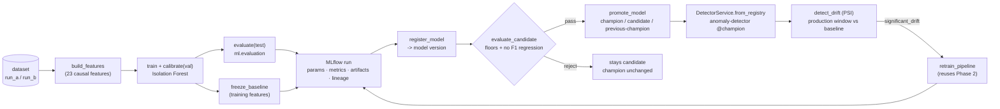

# Phase 6 — MLOps Lifecycle (summary)

## Overview

Phase 6 turns the Phase 2 anomaly detector from *"we trained and evaluated a
model"* into a **reproducible, versioned, observable ML lifecycle**. The Phase 2
evaluation methodology stays authoritative — MLflow *records* its output, it
never replaces it. Every decision in the lifecycle (promotion, drift
classification) is deterministic and LLM-free. Nothing in Phases 1–5 depends on
MLflow; the lifecycle is additive and, where it touches a running service
(inference), it fails safe.

## Key features

- **Experiment tracking (6A)** — every training run's parameters,
  hyperparameters, real `ml.evaluation` metrics, artifacts, and a reproducibility
  lineage block (git SHA, Python + library versions) logged to MLflow; a local
  server via Docker Compose (Postgres backend store, HTTP-served artifacts).
- **Model registry + alias-based promotion (6B)** — models registered as MLflow
  **versions**; `candidate` / `champion` / `previous-champion` **aliases** (never
  deprecated stages); a deterministic gate (`evaluate_candidate`) with quality
  floors + a no-F1-regression guard — a failing candidate stays `candidate`.
- **Registry-backed inference (6C)** — `DetectorService.from_registry` resolves
  the `champion` alias and loads the bundle with the existing
  `AnomalyDetector.load`; the `anomaly-detector` service caches it at startup;
  explicit fail-safe (`MLFLOW_REQUIRED` → 503 or logged `local-fallback`).
- **Drift detection (6D)** — per-feature **Population Stability Index** against a
  training-feature baseline frozen with the champion; standard
  `<0.1 / 0.1–0.25 / ≥0.25` bands; label-free; prediction drift kept separate
  from feature drift and from (label-dependent) performance degradation.
- **Reproducible retraining (6E)** — `python -m ml.mlops retrain` reuses the
  whole Phase 2 pipeline, logs + registers, and runs the 6B gate. Deterministic
  (same dataset + seed → identical metrics). Promotion is opt-in and still
  gated — **no autonomous deployment, no scheduler**.

## MLOps flow



## Real numbers (actual runs, seed 42)

- **Tests:** 1016 passed, 18 deselected (full suite). ~45 Phase 6 tests
  (`tests/ml/test_mlops_*`, `test_monitoring_*`, `test_retraining_*`,
  `tests/anomaly_detector/test_registry_loading.py`).
- **Champion (run_a, exp2 Isolation Forest):** F1 0.818, recall 1.000,
  PR-AUC 0.700 — matches the committed Phase 2 report.
- **Drift `run_a` baseline → `run_b`:** `significant_drift` (n=108) — 11 features
  significant / 4 moderate / 8 none. `latency_mean_ms` PSI 3.7,
  `publish_rate`-family high (run_b has publish-failure instead of latency
  faults); `error_rate` / `success_rate` PSI ≈ 0.006.
- **Retrain on `run_b`:** candidate F1 0.889, recall 1.000, PR-AUC 0.688 →
  gate **PASS** (meets all floors; F1 +0.071 vs champion — the 0.05 tolerance
  only bounds *regressions*, and this is an improvement) → promoted;
  `previous-champion` → v1, `champion` → v2.

## ADRs

| ADR | Decision |
| --- | --- |
| [031](decisions/adr-031-mlflow-tracking-and-registry.md) | MLflow for experiment tracking + registry; local Compose deployment; `mlflow-skinny` client (pandas/numpy untouched); additive fail-safe tracking. |
| [032](decisions/adr-032-model-alias-strategy.md) | Promotion via **aliases** (`candidate` / `champion` / `previous-champion`), never deprecated `Staging` / `Production` stages. |
| [033](decisions/adr-033-model-promotion-criteria.md) | Deterministic `PromotionPolicy` — F1 ≥ 0.75, recall ≥ 0.90, PR-AUC ≥ 0.60, F1 regression tolerance 0.05, grounded in the committed Phase 2 numbers; pure `evaluate_candidate`, no LLM. |
| [034](decisions/adr-034-drift-detection-methodology.md) | Data drift via per-feature **PSI** against a quantile-binned training baseline; standard bands; label-free; drift ≠ degradation. |

## CLI

```bash
export MLFLOW_TRACKING_URI="sqlite:///mlruns/mlflow.db"   # or http://localhost:5000

python -m ml.experiments run exp2_isolation_forest_sentinelops   # + an MLflow run per model
python -m ml.mlops register --model-path <bundle> --run-id <run_id>
python -m ml.mlops promote  --candidate-version 1
python -m ml.mlops list-models
python -m ml.mlops get-champion
python -m ml.monitoring baseline --model-version 1 --data <windows.csv> --output <baseline.joblib>
python -m ml.monitoring check    --baseline <baseline.joblib> --data <windows.csv>
python -m ml.mlops retrain --dataset run_a --seed 42 [--promote-if-passing]
```

## Demo

```bash
# whole lifecycle, no server (throwaway sqlite store):
make phase6-demo
# or against the compose MLflow server:
docker compose up -d --build mlflow
MLFLOW_TRACKING_URI=http://localhost:5000 python scripts/phase6_e2e_demo.py
```

Full write-up: [architecture/phase-6.md](architecture/phase-6.md).
