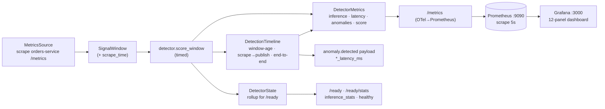

# Phase 7 — Real-Time ML Inference Observability (summary)

## Overview

Phase 7 turns the anomaly-detector's **scrape → score → publish** loop from a
black box into a fully observed path. It adds a purpose-built Prometheus metric
surface for inference performance, a per-cycle detection-latency breakdown
(exposed both as histograms and on the `anomaly.detected` event), an enhanced
`/ready` that carries an in-process statistics rollup plus a soft health signal,
and a provisioned 12-panel Grafana dashboard over a Prometheus that scrapes the
service every 5 s. It builds directly on **ADR-007** (OpenTelemetry is the
instrumentation standard; metrics exported for a Prometheus scrape at
`GET /metrics`) — no new ADR. **No detection logic changed; every number is from
a real run.** Scope is the anomaly-detector plus Prometheus + Grafana;
cross-service OTel rollout and Loki / Tempo / an OTel Collector are deferred.

## Key features

- **Prometheus inference metrics (7A)** — a `DetectorMetrics` inference view
  recorded once per scored window: `detector_inference_requests_total`,
  `detector_inference_duration_seconds` (explicit sub-second buckets),
  `detector_anomalies_detected_total`, `detector_anomaly_score` distribution, and
  **observable** `detector_model_{version,type,info}` gauges (polled every
  collection, so they never go stale in Prometheus). Service name is a resource
  attribute; `model_version` is the only per-metric label.
- **Detection-latency timeline (7B)** — `anomaly_detector/timing.py` keeps a
  per-cycle `DetectionTimeline` (scrape / window-close / inference start+end /
  publish) and derives `detector_window_age_at_scrape_seconds`,
  `detector_scrape_to_publish_seconds`, and
  `detector_detection_latency_end_to_end_seconds`. The same breakdown is attached
  to the `anomaly.detected` payload (`detection_latency_ms` / `scrape_latency_ms`
  / `inference_latency_ms`) — optional, best-effort, debug-only (never
  correlation logic).
- **Enhanced `/ready` (7C)** — a thread-safe `DetectorState` rollup
  (`inference_stats`: counts, anomaly rate, EMA / last / min / max latency, last
  inference time), `uptime_seconds`, and a soft `healthy` / `health_reasons`
  degradation signal (`HEALTH_` thresholds — stale, high anomaly rate, high avg
  latency — **never** changes the HTTP status). The existing `status` / `model_*`
  contract is untouched; `GET /ready/stats` returns just the rollup. Service-level
  aggregate metrics (`detector_service_*`, unlabelled) for "all models" panels.
- **Prometheus + Grafana (7D)** — `docker compose up` starts `prometheus`
  (`:9090`, 5 s scrape of `anomaly-detector:8000/metrics`) and `grafana`
  (`:3000`, `admin`/`admin`) with an auto-provisioned data source and the
  **"Anomaly Detector — Inference & Performance"** dashboard
  (`infrastructure/monitoring/`). Both are best-effort; the app runs if they are
  down.
- **Verification (7E)** — `scripts/phase7_verify.py` (`make phase7-verify`)
  checks the metric families, the `/ready` + `/ready/stats` payloads, and the
  event timing fields — in-process by default (real model, real `score_window`),
  or `--url` / `--grafana-url` against a running stack. `tests/infrastructure/`
  statically validates the dashboard JSON, provisioning YAML, and compose wiring.

## Pipeline



## Metrics added

| # | Series | Type | Meaning |
| --- | --- | --- | --- |
| 1 | `detector_inference_requests_total` | counter | inferences performed (one per window) |
| 2 | `detector_inference_duration_seconds` | histogram | model scoring latency (real sub-second buckets) |
| 3 | `detector_anomalies_detected_total` | counter | windows scored anomalous |
| 4 | `detector_anomaly_score` | histogram | raw anomaly-score distribution |
| 5 | `detector_detection_latency_seconds` | histogram | window close → publish (7A) |
| 6–8 | `detector_model_version` / `_type` / `_info` | observable gauges | live model provenance |
| 9 | `detector_window_age_at_scrape_seconds` | histogram | window close → scrape (7B) |
| 10 | `detector_scrape_to_publish_seconds` | histogram | scrape → publish (7B) |
| 11 | `detector_detection_latency_end_to_end_seconds` | histogram | window close → publish (7B) |
| 12–14 | `detector_service_inference_requests_total` / `_anomalies_detected_total` / `_inference_latency_seconds` | counter/counter/histogram | unlabelled service-level aggregates (7C) |

## Dashboard panels

Inference Requests / sec · Anomalies Detected / sec · Inference Latency
(p50/p95/p99) · End-to-End Detection Latency (p95) · Anomaly Score Distribution
(heatmap) · Current Model Version · Current Model Type · Total Inferences · Total
Anomalies · Anomaly Rate % (gauge, green <10 % / red >25 %) · Service Uptime ·
Latest Inference Latency.

## Real numbers (actual runs)

- **Tests:** 1056 passed, 18 deselected (full suite). 39 new Phase 7 tests —
  `tests/anomaly_detector/test_metrics.py` (8), `test_timing.py` (9),
  `test_state.py` (10), `test_ready_endpoint.py` (5),
  `tests/infrastructure/test_grafana_dashboard.py` (7). Ruff + format + mypy
  green; `docker compose config` valid.
- **`make phase7-verify`** (in-process, real Isolation Forest trained on `run_a`,
  8-window synthetic sequence): all 5 metric families exposed, `/ready` +
  `/ready/stats` carry the full rollup, all 8 `anomaly.detected` payloads carry
  the 3 timing fields.
- **Live `docker compose up`** (kafka + orders-service + anomaly-detector +
  prometheus + grafana, `generate_traffic.py --scenario normal`): Prometheus
  target `anomaly-detector` **up**; Grafana auto-provisioned the data source and
  the dashboard (`uid: anomaly-detector`, 12 panels). Panel values from
  Prometheus: inference latency **p50 34 ms / p95 48 ms / p99 50 ms**,
  end-to-end detection latency **p95 ≈ 95 ms**, model `0.2.0` / `isolation_forest`.

## Known limitations

- `detector_detection_latency_seconds` (7A) and
  `detector_service_inference_latency_seconds` (7C) keep OTel default
  (whole-second) buckets — neither is on a percentile panel.
- The uptime panel needs `process_start_time_seconds` (`prometheus_client`
  registers it only where `/proc` exists — the Linux container, not native
  Windows).
- Only the anomaly-detector is scraped; Prometheus/Grafana are not in CI (7D/7E
  tests are static config checks; end-to-end rendering is a `docker compose up` +
  `make phase7-verify` check).

## Commands

```bash
make phase7-verify                                   # in-process, no Docker
python scripts/phase7_verify.py --url http://localhost:8003 \
    --grafana-url http://localhost:3000              # against a live stack
docker compose up -d --build                         # + prometheus + grafana
#   Grafana  http://localhost:3000  (admin/admin)
#   Prometheus  http://localhost:9090
#   curl -s http://localhost:8003/ready | python -m json.tool
```

Full write-up: [architecture/phase-7.md](architecture/phase-7.md).
