# Phase 9 — AI Root Cause Agent (summary)

## Overview

Phase 9 turns each deterministic incident (Phase 3 / Phase 8) into an
**evidence-backed, explainable root-cause analysis** produced by a controlled
LangGraph investigation agent (`services/rca-agent`). The agent gathers evidence
only through a **closed registry of read-only tools**, runs a fixed
`initialize → plan → collect → analyze → verify → synthesize → validate` graph,
and emits a strongly-typed `RCAReport` whose recommended action **always requires
human approval** (Phase 5 owns execution — there is no executor in the service).
**The LLM proposes; deterministic code decides** — it never controls the tool
allow-list, arguments, resource limits, evidence ids, state, persistence, or
remediation. It ships with a deterministic `MockLlmClient` (default, CI, no API
key) and a live `AnthropicLlmClient` behind the same `LlmClient` protocol.
This work was implemented as **Phase 4**; Phase 9 is the blueprint's number and
the formal close-out (docs + `scripts/phase9_verify.py`) — **no new features**.

## Key features

- **Closed read-only evidence tools (ADR-020)** — 6 AVAILABLE
  (`get_incident`, `get_incident_timeline`, `get_anomaly_evidence`,
  `get_related_incidents`, `get_service_metrics`, `get_service_health`) + 4
  registered-but-UNAVAILABLE (`get_recent_logs`, `get_traces`,
  `get_recent_deployments`, `get_service_dependencies`). Frozen
  `extra="forbid"` request models validated before any I/O; structured
  `ToolResult` (never an exception or stack trace); unavailable sources surfaced
  honestly in the report.
- **Bounded LangGraph engine (ADR-021)** — one conditional router, one bounded
  re-analysis, one bounded synthesis repair, then a guaranteed-valid
  `INSUFFICIENT_EVIDENCE` fallback. `check_limits` (`RCA_*`: 12 tool calls, 25
  steps, 40 evidence items, 120 s wall clock, 5 hypotheses) at the top of every
  node — wall-clock breach → `TIMED_OUT`, count breach → graceful degradation.
- **Mock / live LLM boundary (ADR-022)** — `RCA_MODE=mock` deterministic, no
  network; `RCA_MODE=live LLM_PROVIDER=anthropic` makes one forced-tool-use
  Anthropic call per operation, parsed into the existing `*Result` DTO or
  rejected as `LlmMalformedOutput`. `build_llm_client` never silently falls back
  to mock.
- **Prompt-injection defense (ADR-021)** — fixed `SYSTEM` policy → `SYSTEM` tool
  catalogue → `USER` task + `BEGIN/END UNTRUSTED EVIDENCE`. Structural
  guarantees (closed registry, closed action enum, evidence-ref validation, no
  executor) hold even if the prompt defense fails; adversarial tests confirm it.
- **Investigation API + Kafka (ADR-023)** — `incident.opened` → idempotent
  consumer → investigation; `POST /investigations`, `GET /investigations/{id}`
  (+ `/steps`), `GET /incidents/{id}/investigation`. Separate service, own DB
  lineage (`alembic_version_rca`), reads incidents over HTTP only.

## Tool schema

| AVAILABLE | UNAVAILABLE (honest interface, never fabricated) |
| --- | --- |
| `get_incident` | `get_recent_logs` (no Loki) |
| `get_incident_timeline` | `get_traces` (no Tempo) |
| `get_anomaly_evidence` | `get_recent_deployments` (no deploy metadata) |
| `get_related_incidents` | `get_service_dependencies` (no runtime dep-graph tool) |
| `get_service_metrics` (point-in-time) | |
| `get_service_health` | |

## Investigation flow

```mermaid
flowchart LR
  START --> INIT[initialize<br/>load incident]
  INIT --> PLAN[plan<br/>LLM proposes tool plan → validate]
  PLAN --> COLLECT[collect ⟲<br/>run read-only tools, append Evidence]
  COLLECT --> ANALYZE[analyze<br/>LLM → findings + hypotheses]
  ANALYZE --> VERIFY[verify<br/>LLM → verdict per hypothesis]
  VERIFY -->|inconclusive, budget left| ANALYZE
  VERIFY --> SYNTH[synthesize<br/>LLM → draft; code assembles RCAReport]
  SYNTH --> VALIDATE[validate<br/>validate_report]
  VALIDATE -->|invalid| SYNTH
  VALIDATE --> END[(RCAReport<br/>human-approval-gated)]
```



## Real numbers (actual runs)

- **Tests:** `tests/rca_agent/` — **269 passed, 1 deselected** (`-m integration`).
  Full suite still green. Ruff + `ruff format --check` + `mypy --strict` (344
  source files) all pass.
- **`make phase9-verify`** (mock, in-process, no key):
  - *Mock RCA scenario* — `COMPLETED`; root cause "Abnormal error_rate in
    orders-service is the primary driver of this incident"; confidence `MEDIUM`;
    8 evidence items collected, 4 cited by the root cause; 6 tool calls, 12 steps;
    2 hypotheses both `SUPPORTED`; recommendation `CONTACT_SERVICE_OWNER`,
    `requires_human_approval = True`; 4 unavailable sources surfaced.
  - *End-to-end scenario* — `incident.opened` → idempotent consumer (redelivery
    is a no-op) → `COMPLETED` investigation → `GET /incidents/{id}/investigation`
    and `GET /investigations/{id}` both `200` with an evidence-grounded RCA (7
    evidence items).
- **RCA-quality harness** (`test_eval_scenarios.py`): `sufficient` → `COMPLETED`,
  `insufficient` → `INSUFFICIENT_EVIDENCE` (root cause `None`), `adversarial` →
  safe terminal state, registry unchanged. Outcome classes only — no fabricated
  accuracy figures.

## Commands

```bash
RCA_MODE=mock python scripts/rca_scenario.py         # deterministic in-process demo
RCA_MODE=mock python scripts/rca_e2e_scenario.py     # incident.opened -> consumer -> RCA -> API
python scripts/phase9_verify.py                      # drives both, checks the RCAReport
python scripts/phase9_verify.py --url http://localhost:8004   # + live Investigation API
make phase9-verify ; make phase9-summary
python -m pytest tests/rca_agent -q
```

Full write-up: [architecture/phase-9.md](architecture/phase-9.md) ·
[architecture/phase-4.md](architecture/phase-4.md) (engineering detail).
